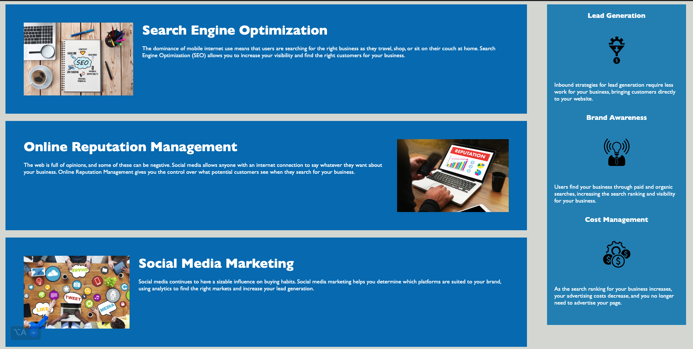

# 04-code-refactor-challenge

## HTML refactor for accessibility

This refactor improves the accessibility of the webpage by:

* Using more semantic tags
* Adding attributes to images
* Fixing broken in-page links
* Correcting the icons to reflect the section to be relevant
* Adding comments

### Specific changes

* The following semantic tags were added:
    * `header`
    * `nav`
    * `main`
    * `section`
    * `article`
    * `footer`
* The following attributes were added to images:
    * `alt`
* All broken in-page links were fixed.
* All icons were corrected to reflect the section to be relevant.
* Comments were added throughout the code to help other developers quickly identify whats in a particular section.

### Benefits

These changes make the webpage more accessible to users with disabilities, including:

* Blind users can use screen readers to understand the content of the page and navigate between elements.
* Users with low vision can use the alt text attributes to understand the content of images.
* Users with mobility impairments can use the keyboard to navigate between elements and activate links.
* Users with cognitive impairments can use the relevant icons to quickly understand the content of the page.
* Developers and maintainers can more easily understand the code and make changes.

### Links

* GitHub repository: [link to GitHub repository]
* Website: [link to website]

#### navbar

#### Hero Section

#### Main Content

#### Main Content

